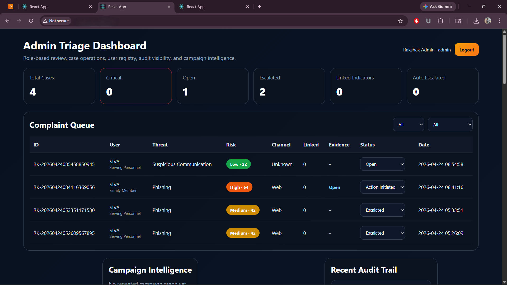
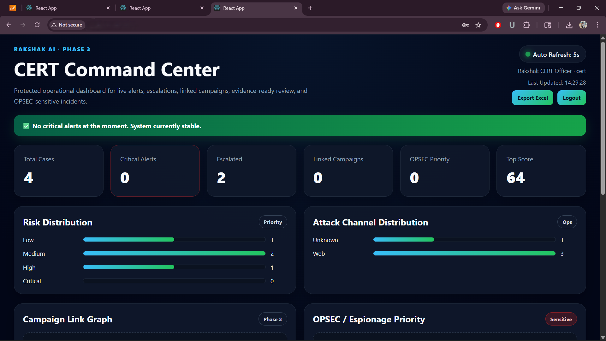

# 🔐 Rakshak AI — Cyber Safety Portal for Defence

AI-powered cyber incident reporting and threat intelligence platform designed for defence personnel, families, and veterans.

---

## 🚀 Overview
Rakshak AI helps users report suspicious messages, links, or cyber incidents.

The system analyzes threats using a hybrid AI engine and provides risk scores, classifications, and actionable insights.

---

## 🧠 AI Engine
- Rule-based detection (keywords, URL patterns)
- Machine Learning model (TF-IDF + Logistic Regression)
- Hybrid decision logic (rule + ML)
- Explainable outputs (reason + confidence)

---

## 📊 Features
- Complaint submission with evidence (text, URL, screenshot)
- Threat classification (Phishing, OPSEC Risk, etc.)
- Risk scoring (Low / Medium / High / Critical)
- Campaign detection (linked cases)
- Admin dashboard for triage
- CERT Command Center with analytics

---

## 🏗️ Architecture

User → Frontend (React) → Backend (FastAPI) → AI Engine → Database → Dashboards

---

## 🧰 Tech Stack
- Frontend: React
- Backend: FastAPI (Python)
- Database: SQLite
- AI/ML: Scikit-learn (TF-IDF + Logistic Regression)

---

## 📸 Screenshots

---

---

---

## 🔥 Real Problems I Faced
- Model accuracy inconsistency
- Handling real vs synthetic data
- Securing API endpoints
- Managing evidence uploads

---

## ✅ How I Solved
- Tuned TF-IDF + Logistic Regression
- Balanced dataset (real + synthetic)
- Added authentication & validation
- Implemented structured storage for evidence

---

## 💡 Why This Project
Most cyber incident reporting systems are slow and manual.

Rakshak AI aims to automate threat analysis and reduce response time using AI-powered decision support.

This project was built to explore real-world applications of AI in cybersecurity.

---

## 🌍 Live Demo
Frontend can be deployed on Vercel. Backend can be hosted on AWS EC2.

---

## 🎯 Future Improvements
- Deploy full system on AWS (EC2 + S3)
- Add deep learning models
- Integrate threat intelligence APIs
- Real-time alerts & notifications

---

## 👨‍💻 Author
Boomesh  
Cloud Engineering Learner (AWS) | AI Developer
